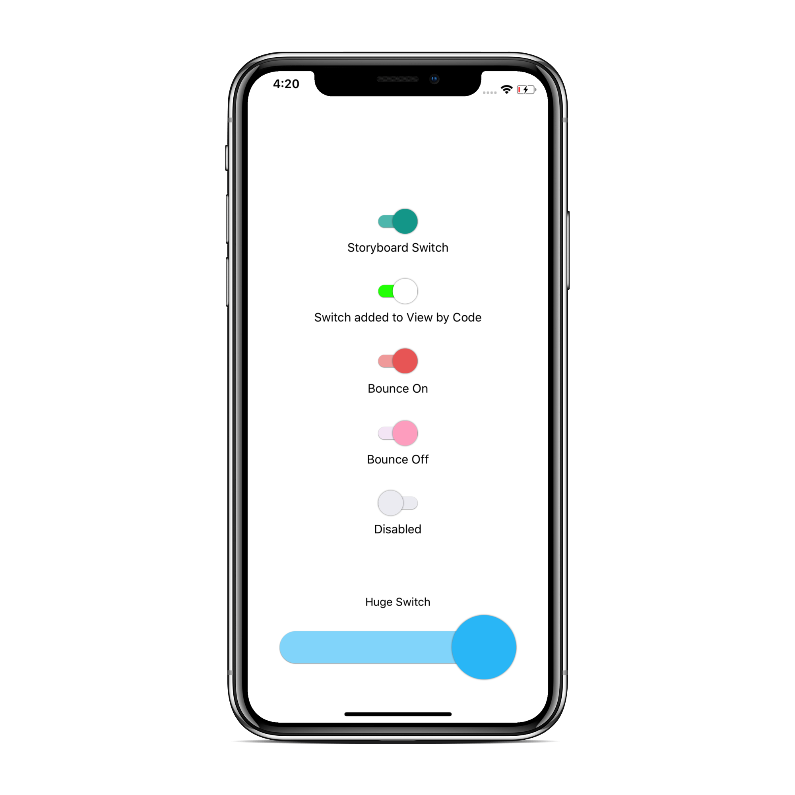
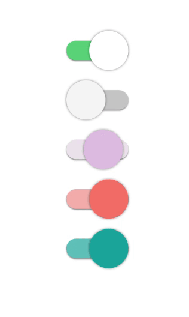
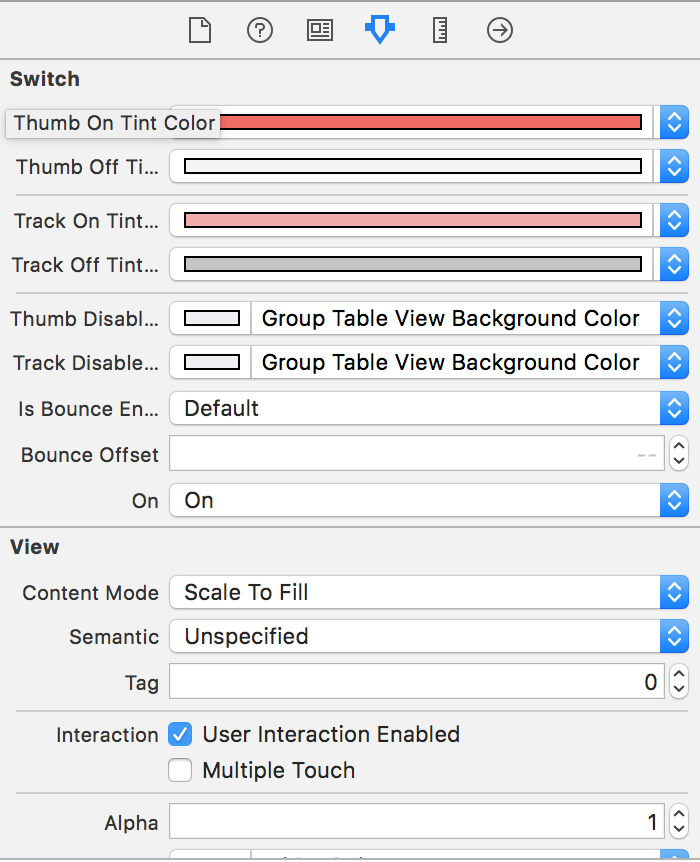

# PVSwitch

[](https://travis-ci.org/pulkit-vaid/PVSwitch)
[](http://cocoapods.org/pods/PVSwitch)
[](http://cocoapods.org/pods/PVSwitch)
[](http://cocoapods.org/pods/PVSwitch)

## Overview


`PVSwitch` is a Customizable Switch with the design inspired by Android's Switch. 

This library has customizable properties that can be tweaked right from the `Storyboard` i.e. `Inspectable Properties`, making you play around with the Switch UI at compile time. 

      &nbsp;&nbsp;&nbsp;&nbsp;&nbsp;&nbsp;&nbsp;&nbsp;&nbsp;&nbsp;&nbsp;&nbsp;&nbsp;&nbsp;&nbsp;&nbsp;&nbsp;

<br/>
<br/> 
## Installation
* **CocoaPods** <br/>
`PVSwitch` is available on CocoaPods.
You can use this library by adding the following command onto your Podfile:
```ruby
pod "PVSwitch"
```

* **Manual** <br/>
Just Drag+Drop the Source file into yor project. `PVSwitch/Source/PVSwitch.swift`


## Usage
 <br/>

* **Storybord**  <br/>
The simplest way to use `PVSwitch` is from the `Storyboard`. Just drag a view into the Storyboard and in the `Identity Inspector (⌘ ⌥ 3)` and set the `Class` field in `Custom Class` section to **PVSwitch**. 
The storyboard refreshes itself to bring up the inspectable properties to fiddle around with. 

<br/>
<br/>

* **Code** <br/>
Adding `PVSwitch` through the code is as easy as using it from the Storyboard. <br/>
Considering our `ViewController` has a `Container View` and `PVSwitch` has to be added as a subview.

```swift 
class ViewController: UIViewController {
	let switchByCode = PVSwitch()
	@IBOutlet var containerView: UIView!

	override func viewDidLoad() {
		super.viewDidLoad()
		self.setupSwitch()
	}
}
```
Setting up the Switch
```swift
private func setupSwitch() {
	//Customize the Properties if the Switch is added by Code
	switchByCode.isOn = true

	switchByCode.isBounceEnabled = false

	switchByCode.thumbOnTintColor = .white
	switchByCode.trackOnTintColor = .green

	switchByCode.thumbOffTintColor = .darkGray
	switchByCode.trackOffTintColor = .lightGray

        //To handle the events
	switchByCode.addTarget(self, action: #selector(ViewController.codeSwitchAction(sender:)), for: .valueChanged)
	containerView.addSubview(switchByCode)
}
```
One last thing to do for this to work. In `viewDidLayoutSubviews` make sure to update the frames of the `PVSwitch` to be the container's bounds. 
```swift
override func viewDidLayoutSubviews() {
	super.viewDidLayoutSubviews()

	//Make sure to set the frame of the switch if the Switch is added by Code
	switchByCode.frame = containerView.bounds
}
```

## Change History
1.0.0 Initial Release

## Requirements
iOS 11.0 or later

## Author
Pulkit Vaid

## License
PVSwitch is available under the MIT license.

### Credits
This Switch is inspired by [JTMaterialSwitch](https://github.com/JunichiT/JTMaterialSwitch/)
